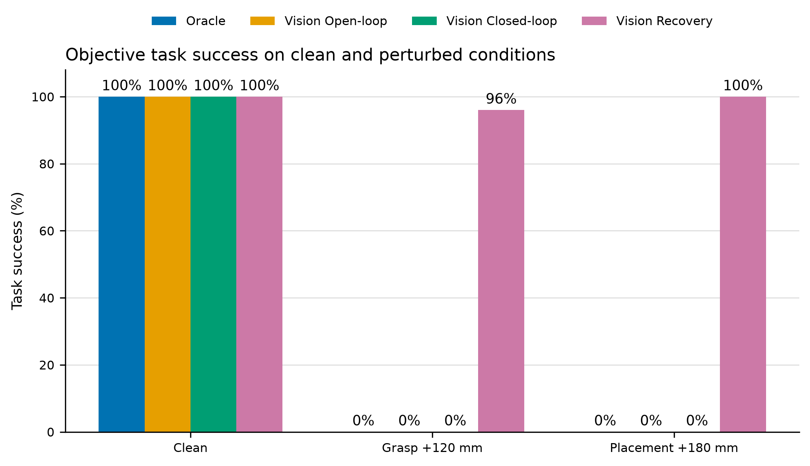
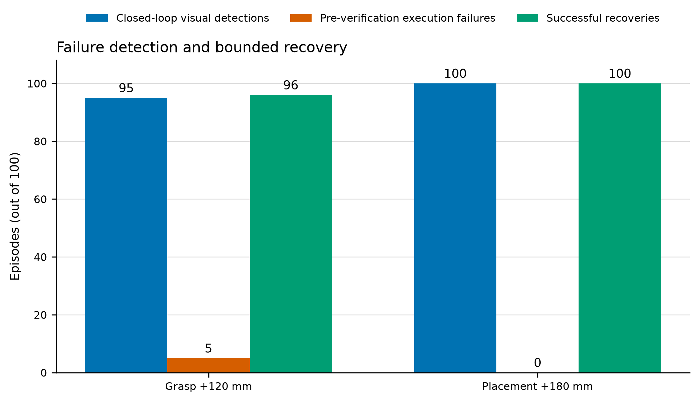
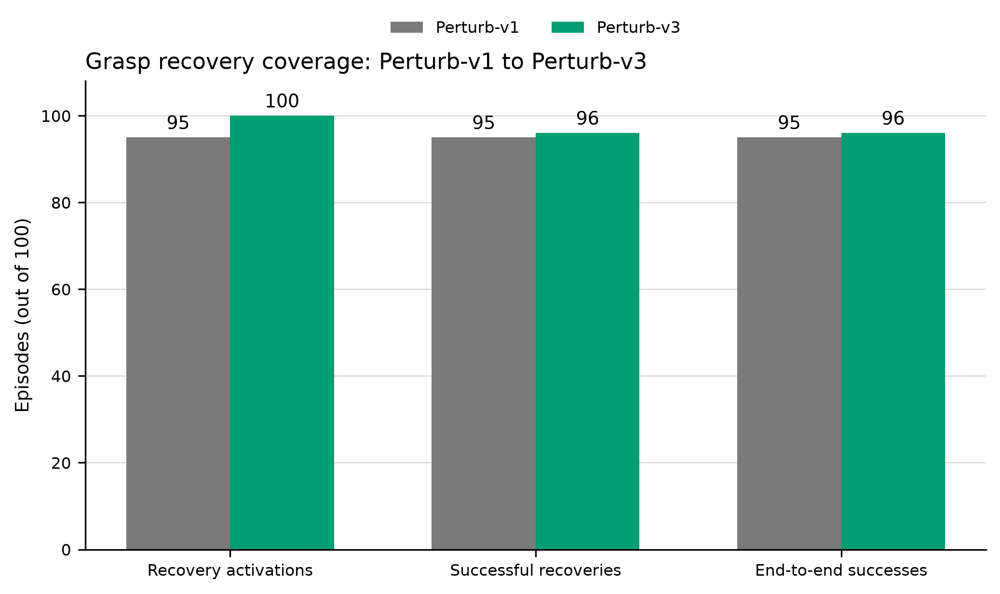

# Embodied Manipulation Agent

Embodied Manipulation Agent is a deterministic PyBullet pick-and-place system that turns language instructions into physical actions using RGB-D perception, language-conditioned cube and tray grounding, manipulation planning, fresh visual verification, structured execution diagnostics, and one bounded recovery attempt.

## Why this project

Open-loop execution can finish without knowing whether the intended object was lifted or placed correctly. This project makes that distinction explicit. It separates objective task success from the agent's internal execution result, verifies grasp and placement from new visual evidence, preserves structured failures that occur before verification, and tests whether a single nominal retry can correct a controlled first-attempt error.

The result is an inspectable engineering baseline rather than a learned policy: every observation, plan, execution result, verification result, diagnosis, and recovery attempt has a defined role.

## Architecture

```mermaid
flowchart LR
    A[Language instruction] --> B[Deterministic parser]
    B --> C[RGB-D perception]
    C --> D[Semantic grounding]
    D --> E[Task planner]
    E --> F[Physical execution]
    F -->|Closed-loop / Recovery: execution completes| G[Fresh visual verification]
    G -->|verified| H[Simulator ground-truth objective evaluation]
    H -->|objective success| S[Objective success]
    H -->|objective failure| X[Terminal failure]
    G -->|failed: Closed-loop| X
    G -->|failed: Recovery only| I[Structured diagnosis]
    F -->|eligible structured failure: Recovery only| I
    F -->|other execution failure| X
    I --> J[Fresh RGB-D]
    J --> K[Re-ground]
    K --> L[Nominal replan]
    L --> M[ONE bounded unperturbed retry]
    M -->|execution completes| N[Fresh verification]
    M -->|execution fails| X
    N -->|verified| H
    N -->|failed| X
```



The compact control loop is:

**Perception → Grounding → Planning → Action → Verification → Recovery**

Recovery uses the post-failure RGB-D evidence available at entry. A failed verification already supplies a fresh observation; an eligible structured execution failure that occurs before verification triggers a dedicated fresh capture. The agent then re-grounds the intended cube and tray, replans without the injected perturbation, and retries once. `MAX_RECOVERY_ATTEMPTS` is fixed at `1`.

## Demo and visual walkthrough

### Bounded recovery demo

https://github.com/user-attachments/assets/52db9789-acc1-4f68-b8ca-540b184a7fbe

*Seed 56 — +120 mm first-attempt grasp perturbation, structured failure diagnosis, fresh RGB-D re-grounding, nominal replanning, and one bounded retry.*

The agent demos require a working graphical display. The primary closed-loop and recovery paths are:

```bash
python -m embodied_manipulation.agent.closed_loop_demo
python -m embodied_manipulation.agent.recovery_demo --failure grasp
python -m embodied_manipulation.agent.recovery_demo --failure placement
python -m embodied_manipulation.agent.recovery_demo --failure preverification-ik
```

The grasp recovery demo applies the same +120 mm first-attempt offset used by the benchmark, exposes the failed verification or structured execution evidence, obtains recovery RGB-D, re-grounds the intended objects, replans nominally, retries once, and verifies the outcome.

One frozen Perturb-v3 episode makes the pre-verification path concrete. In seed 56, the shifted grasp produced persistent bilateral non-target contact and a gripper timeout before visual verification. A fresh RGB-D recovery observation re-grounded the intended red cube and target tray. The nominal retry grasp and placement both passed visual verification, and the episode ended in objective success.

Lower-level GUI demos remain available:

```bash
python -m embodied_manipulation.simulation.demo
python -m embodied_manipulation.control.demo
python -m embodied_manipulation.control.pick_demo
python -m embodied_manipulation.control.pick_place_demo
python -m embodied_manipulation.agent.open_loop_demo
```

## Key results

The table reports objective task success only. Clean-v2 and Perturb-v3 use separate denominators.

| Condition | Oracle | Open-loop | Closed-loop | Recovery |
| --- | ---: | ---: | ---: | ---: |
| Clean | 100/100 | 100/100 | 100/100 | 100/100 |
| Grasp +120 mm | 0/100 | 0/100 | 0/100 | 96/100 |
| Placement +180 mm | 0/100 | 0/100 | 0/100 | 100/100 |

Closed-loop objective success is intentionally distinct from failure-detection performance.



Across the final perturbation runs, every Vision method × condition group achieved 100/100 source grounding and 100/100 target grounding. Mean source and target position errors were approximately 2.47 mm and 2.63 mm, respectively. This helps separate localization error from downstream execution and recovery effects within these scenarios; it does not establish general visual robustness.

## Why closed-loop verification matters

The perturbed Closed-loop method does not retry, so its objective task success remains 0/100. Its contribution is detecting that physical execution did not accomplish the task.

| Condition | Visual verification detections | Pre-verification execution failures |
| --- | ---: | ---: |
| Grasp +120 mm | 95/100 | 5/100 |
| Placement +180 mm | 100/100 | 0/100 |

For the grasp perturbation, 95 episodes reached visual grasp verification and were rejected there. The other five failed earlier during execution. They are structured execution failures, not visual misses.



## Failure recovery

| Condition | Activations | Attempts | Successful recoveries | Bounded failures | Pre-verification entries | Post-verification entries | End-to-end success |
| --- | ---: | ---: | ---: | ---: | ---: | ---: | ---: |
| Grasp +120 mm | 100 | 100 | 96 | 4 | 5 | 95 | 96/100 |
| Placement +180 mm | 100 | 100 | 100 | 0 | 0 | 100 | 100/100 |

End-to-end success uses all 100 primary episodes in a condition. Conditional recovery success uses recovery activations as its denominator. They coincide in Perturb-v3 because all 100 failures activate recovery, but they are conceptually different metrics.

Historical Perturb-v1 ended the grasp condition at 95/100 success from 95 activations and 95 successful recoveries. Perturb-v3 expanded eligibility to five previously uncovered pre-verification failures, producing 100 activations, 96 successful recoveries, and 96/100 final success. Seed 56 was newly recovered. The change from 95/95 to 96/100 conditional recovery reflects denominator expansion, not a like-for-like regression.



Four grasp seeds remained bounded failures: `10`, `17`, `46`, and `79`. Their nominal recovery pre-grasp IK residuals remained above the unchanged 4 mm execution tolerance. These failures are preserved in the frozen evidence rather than tuned away.

## System components

| Component | Responsibility |
| --- | --- |
| `language/` | Deterministic parsing of source object and target receptacle descriptions |
| `perception/` | Oracle and HSV/RGB-D geometric localization |
| `planning/` | Pick-and-place primitives and task-level plans |
| `control/` | IK, arm motion, contact-aware gripper control, grasp, and placement |
| `agent/` | Open-loop, verification-only, and bounded-recovery agents |
| `simulation/` | PyBullet world, camera, robot, and scene objects |
| `benchmark/` | Seeded scenarios, frozen perturbations, execution, metrics, and evidence persistence |
| `tests/` | Unit, integration, benchmark-contract, and evidence-integrity tests |

### Evaluated methods

| Method | Definition |
| --- | --- |
| Oracle scripted | Scripted baseline using simulator-ground-truth geometry |
| Vision open-loop | Initial RGB-D grounding followed by execution without feedback-based correction |
| Vision closed-loop | Initial grounding plus fresh grasp and placement verification, with no retry |
| Vision recovery | Verification or structured failure evidence followed by recovery RGB-D, re-grounding, nominal replanning, and one retry |

## Reproducible evaluation

The final perturbation benchmark used pre-registered one-shot geometric perturbations:

| Protocol field | Frozen value |
| --- | --- |
| Benchmark version | `phase14d-perturb-v3` |
| Commit | `2cf0bea7e0473ca2c7bddcafb1256457e20de386` |
| Seeds | `0..99` |
| Conditions | 2 |
| Methods | 4 |
| Primary perturbation episodes | 800 |
| Difficulty | `basic` |
| Distractors | `seed % 3` |
| Grasp perturbation | `grasp_shift_x_120mm`: +0.12 m X on the first grasp target only |
| Placement perturbation | `placement_shift_x_180mm`: +0.18 m X on the first placement target only |
| Recovery retry | Unperturbed |
| Maximum recovery attempts | 1 |
| Reproducibility replay | 40/40 deterministic logical matches |
| Post-run tests | 171 passed |

Each method receives a fresh World for a given condition and seed. The Clean-v2 result contains 400 separate primary episodes and is not combined with the 800-episode Perturb-v3 denominator.

The CLI can reproduce the frozen Perturb-v3 protocol:

```bash
python -m embodied_manipulation.benchmark.runner \
  --start-seed 0 \
  --episodes 100 \
  --methods oracle_scripted vision_open_loop vision_closed_loop vision_recovery \
  --perturbations grasp_shift_x_120mm placement_shift_x_180mm
```

This command runs 800 new simulator episodes. It does not overwrite or recreate the original frozen artifact directory; it writes a new timestamped directory under the ignored `outputs/benchmarks/` path. Use the shorter smoke command below when checking installation or infrastructure.

## Installation and quick start

The project requires Python 3.11 or newer. Using the existing project environment:

```bash
conda activate embodied-manip
python -m pip install -e ".[dev]"
```

Run the complete test suite:

```bash
python -m pytest -q
```

Run a clean closed-loop GUI episode:

```bash
python -m embodied_manipulation.agent.closed_loop_demo
```

Run a bounded recovery GUI episode:

```bash
python -m embodied_manipulation.agent.recovery_demo --failure grasp
```

Run the existing 12-seed clean smoke benchmark. It creates 48 primary episodes because all four methods are enabled by default:

```bash
python -m embodied_manipulation.benchmark.runner --start-seed 0 --episodes 12
```

Generated benchmark artifacts are written under ignored `outputs/benchmarks/` directories. The smoke run checks the pipeline; it is not the frozen final evaluation.

## Repository structure

```text
embodied_manipulation/
├── agent/          # Open-loop, verification-only, and recovery agents
├── benchmark/      # Scenarios, perturbations, runner, metrics, and evidence
├── control/        # IK, arm, gripper, grasp, and placement control
├── language/       # Instruction parsing and task representation
├── perception/     # Oracle and RGB-D localization
├── planning/       # Manipulation primitives and task planning
└── simulation/     # PyBullet world, robot, camera, and objects
tests/              # Behavior, protocol, and evidence-contract tests
```

## Limitations

- The system runs in PyBullet simulation only; it has not been evaluated on a real robot.
- Language parsing is deterministic and supports a constrained instruction grammar.
- Perception uses known cube/tray color classes and HSV/RGB-D geometry.
- The frozen evaluation covers basic scenarios, two fixed one-shot perturbations, and distractor counts determined by `seed % 3`.
- Recovery is a hand-designed procedure with one bounded retry. It is not learned recovery.
- This is not a vision-language-action model, reinforcement-learning policy, imitation-learning policy, or foundation-model robotics system.
- The evaluation does not establish robustness to arbitrary noise, occlusion, domain shift, unseen environments, or unrestricted failures.
- Wall-clock measurements are machine-specific, and early execution rejection changes simulation-step counts.

## Technical notes and design principles

- **Objective evaluation is separate from internal success.** Simulator-ground-truth evaluation determines final task success; agent and controller results remain diagnostic evidence.
- **Visual feedback is stage-specific.** Closed-loop execution verifies the grasp before placement and verifies placement after settling.
- **Execution failures remain structured.** IK-admissibility and contact-timeout diagnostics can trigger recovery before a visual verification frame exists.
- **Recovery is bounded and nominal.** The injected perturbation affects only the first relevant attempt. The single retry uses a newly grounded nominal plan.
- **Benchmark evidence is immutable.** Primary JSONL/CSV records, summaries, paired seed results, failure evidence, metadata, and deterministic replay checks preserve the frozen protocol and outcomes.
